# 🏛️ AI-Powered Citizen Grievance Intelligence Platform

Prototype : https://hackfushion-ai-powered-citizen-grievance.onrender.com/
( Simple Demo not end to end )

> **From Citizen Complaints to Intelligent, Coordinated and Verifiable Civic Action**

[](LICENSE)
[](https://nodejs.org/)
[](https://reactjs.org/)
[](https://www.typescriptlang.org/)
[](https://mongodb.com/)
[](https://tailwindcss.com/)

---

## 📋 Table of Contents

1. [Project Overview](#-project-overview)
2. [Problem Statement](#-problem-statement)
3. [Proposed Solution](#-proposed-solution)
4. [Key Features](#-key-features)
5. [System Architecture](#-system-architecture)
6. [AI Orchestrator](#-ai-orchestrator)
7. [User Roles & Workflows](#-user-roles--workflows)
   - [Citizen Workflow](#citizen-workflow)
   - [Officer Workflow](#officer-workflow)
   - [Admin Workflow](#admin-workflow)
8. [Core Workflows](#-core-workflows)
   - [Complaint Submission Flow](#complaint-submission-flow)
   - [AI Analysis Pipeline](#ai-analysis-pipeline)
   - [Incident Intelligence Flow](#incident-intelligence-flow)
   - [Priority Calculation Flow](#priority-calculation-flow)
   - [Department Routing Flow](#department-routing-flow)
   - [Resolution & Verification Flow](#resolution--verification-flow)
   - [Reopen & Escalation Flow](#reopen--escalation-flow)
   - [Notification Flow](#notification-flow)
   - [Duplicate vs Civic Incident Detection](#duplicate-vs-civic-incident-detection)
   - [Killer Demo Flow](#killer-demo-flow)
9. [Complaint Status Lifecycle](#-complaint-status-lifecycle)
10. [Data Models](#-data-models)
11. [API Reference](#-api-reference)
12. [Folder Structure](#-folder-structure)
13. [Technology Stack](#-technology-stack)
14. [Security Architecture](#-security-architecture)
15. [Environment Configuration](#-environment-configuration)
16. [Installation & Setup](#-installation--setup)
17. [Running the Application](#-running-the-application)
18. [Demo Data & Seeding](#-demo-data--seeding)
19. [Testing](#-testing)
20. [Deployment](#-deployment)
21. [CI/CD Pipeline](#-cicd-pipeline)
22. [Analytics & Monitoring](#-analytics--monitoring)
23. [Accessibility & Internationalisation](#-accessibility--internationalisation)
24. [Contributing](#-contributing)
25. [Hackathon Presentation Guide](#-hackathon-presentation-guide)
26. [License](#-license)

---

## 🎯 Project Overview

The **AI-Powered Citizen Grievance Intelligence Platform** is a full-stack, production-grade civic-tech solution that transforms the way citizens report, track, and resolve civic problems.

Unlike traditional grievance systems that register individual tickets, this platform uses an AI Orchestrator with specialised agents to:

- Understand complaints in **Tamil, English, and Tanglish**
- Accept **text, voice, image, and location** as input
- Detect **duplicate complaints** and prevent redundancy
- Identify when multiple complaints share the same root cause, forming a **civic incident**
- Calculate **AI-powered priority scores** transparently
- **Route complaints** to the responsible department automatically
- Keep citizens informed with a **real-time progress timeline**
- **Verify resolution** by asking the citizen — and automatically **reopen** if unresolved

> **"We don't just register complaints. We understand the civic incident behind them, coordinate the response, keep citizens informed, and verify that the problem is actually resolved."**

---

## ❗ Problem Statement

Government and municipal departments receive large numbers of complaints across multiple channels and languages. Existing grievance systems mainly register and route individual complaints; they rarely identify the **larger civic incident** behind multiple complaints.

| Pain Point | Current Reality | Our Platform |
|---|---|---|
| Language barrier | English-only forms | Tamil + English + Tanglish |
| Complaint modality | Text forms only | Text + Voice + Image + Location |
| Incident detection | Manual grouping | Semantic + Spatial + Temporal AI clustering |
| Priority | Static / per-ticket | Dynamic incident-level AI scoring |
| Department routing | Manual assignment | AI-recommended with officer approval |
| Citizen visibility | Acknowledgement email only | Real-time progress timeline |
| Resolution verification | Officer marks closed | Citizen confirms — reopen if rejected |
| Cross-department coordination | Siloed | Shared incident with multi-department support |

**Core gap**: Not complaint registration alone, but **intelligent incident detection, coordinated response, transparent progress tracking, and verified resolution**.

---

## 💡 Proposed Solution

An AI-powered civic platform that allows citizens to report problems naturally and receives intelligent, coordinated responses.

```
Citizen Signal
      ↓
AI Understanding
      ↓
Incident Intelligence
      ↓
Priority & Risk
      ↓
Department Coordination
      ↓
Live Progress
      ↓
Resolution
      ↓
Citizen Verification
      ↓
Reopen if Unresolved
```

---

## ✨ Key Features

### 🗣️ Multilingual AI
Natural-language complaint understanding in **Tamil, English, and Tanglish** with no forced category selection.

### 🎤 Multimodal Input
Accept **text, voice, image, and location** as complaint evidence.

### 🧠 Civic Incident Intelligence
Combines **semantic + spatial + temporal** signals to detect when multiple complaints represent a single civic incident.

### 📊 AI Priority & Routing
Transparent priority scoring using complaint volume, severity, recency, geographic concentration, and safety risk — then recommends the responsible department.

### 📍 Live Complaint Tracking
Citizens track every step: `Submitted → Analyzed → Assigned → In Progress → Resolved → Verified`

### 🔄 Closed-Loop Resolution
Citizens report **"Still Unresolved"** — system automatically reopens and escalates the incident.

### 🔒 Enterprise-Grade Security
JWT authentication, RBAC, rate limiting, input sanitisation, audit logging.

### 🗺️ Interactive Civic Map
Incident clusters, heatmaps, ward boundaries, and priority overlays.

---

## 🏗️ System Architecture

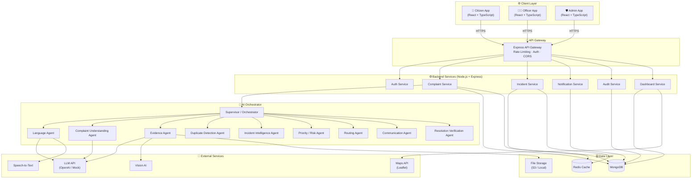

---

## 🤖 AI Orchestrator

The AI Orchestrator is **not a login role**. It is the intelligence layer connecting citizens and officers.

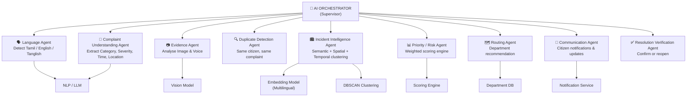

### Agent Responsibilities

| Agent | Responsibility |
|---|---|
| **Language Agent** | Detect complaint language (Tamil / English / Tanglish) |
| **Complaint Understanding Agent** | Extract category, issue, time, severity, affected population |
| **Evidence Agent** | Analyse uploaded images and voice recordings |
| **Duplicate Detection Agent** | Identify repeat submissions from the same citizen |
| **Incident Intelligence Agent** | Cluster related complaints into civic incidents |
| **Priority / Risk Agent** | Calculate weighted priority score |
| **Routing Agent** | Recommend lead and supporting departments |
| **Communication Agent** | Generate citizen-facing notifications in their language |
| **Resolution Verification Agent** | Handle citizen confirmation or reopen logic |

---

## 👥 User Roles & Workflows

### Citizen Workflow

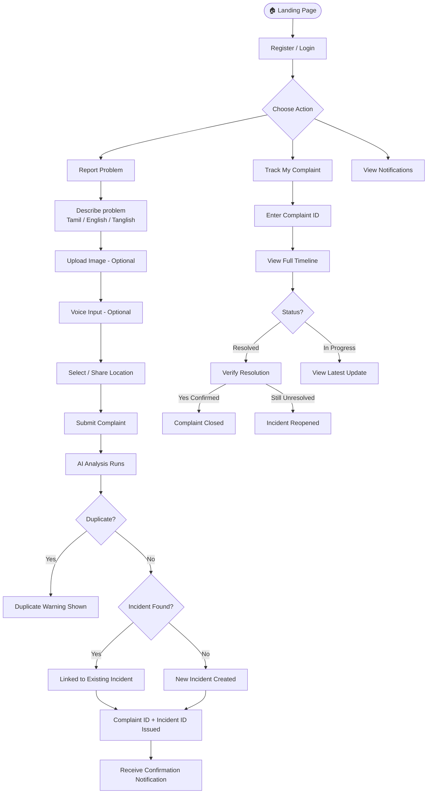

---

### Officer Workflow

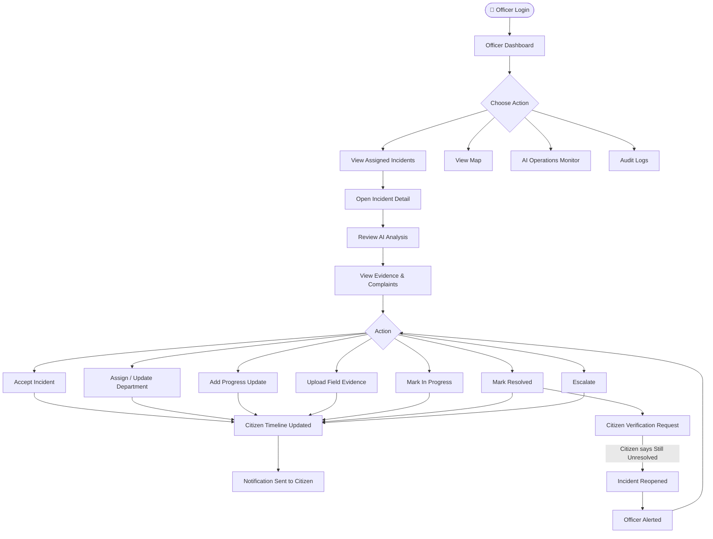

---

### Admin Workflow

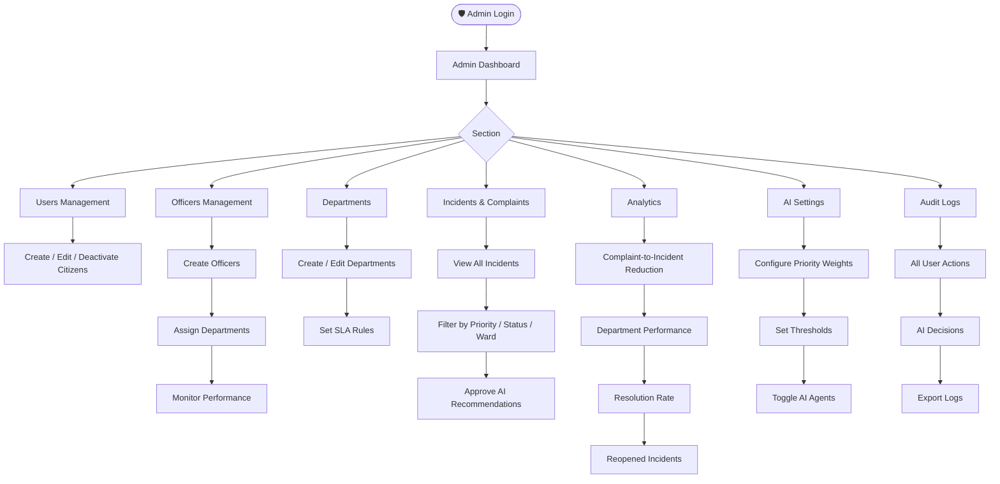

---

## 🔄 Core Workflows

### Complaint Submission Flow

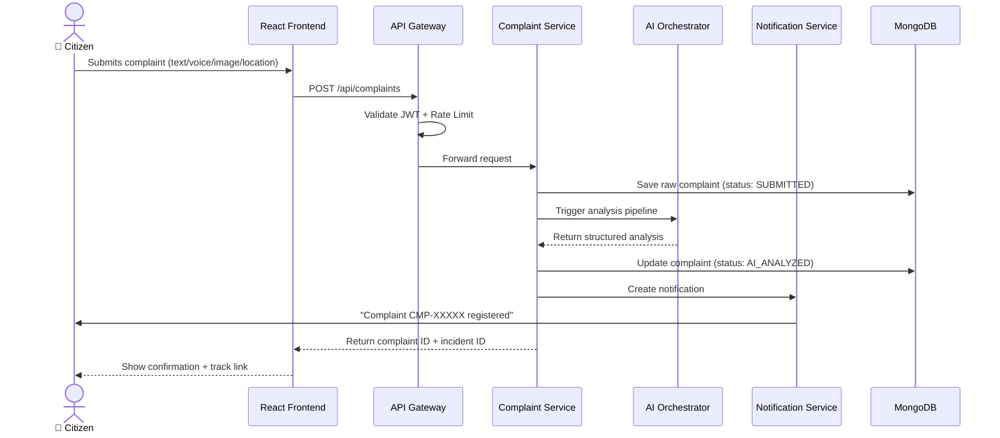

---

### AI Analysis Pipeline

```mermaid
flowchart LR
    IN["Raw Complaint\nText / Voice / Image / Location"]

    IN --> S1["🗣️ Language Detection\nTamil / English / Tanglish"]
    S1 --> S2["📝 Complaint Understanding\nCategory · Issue · Time · Severity"]
    S2 --> S3["📷 Evidence Analysis\nImage tags · Voice transcript"]
    S3 --> S4["🔍 Duplicate Check\nSame citizen · Same content"]
    S4 -->|Duplicate| DUP["⚠️ Duplicate Warning"]
    S4 -->|Unique| S5["🏙️ Incident Intelligence\nSemantic + Spatial + Temporal"]
    S5 -->|Match Found| INC_EXIST["Link to Existing Incident\nIncrement complaint count"]
    S5 -->|No Match| INC_NEW["Create New Incident"]
    INC_EXIST & INC_NEW --> S6["📊 Priority Calculation\nWeighted Score 0-100"]
    S6 --> S7["🗺️ Department Routing\nLead + Supporting Department"]
    S7 --> S8["📢 Citizen Notification\nIn citizen's language"]
    S8 --> OUT["✅ Structured Complaint + Incident Ready"]
```

---

### Incident Intelligence Flow

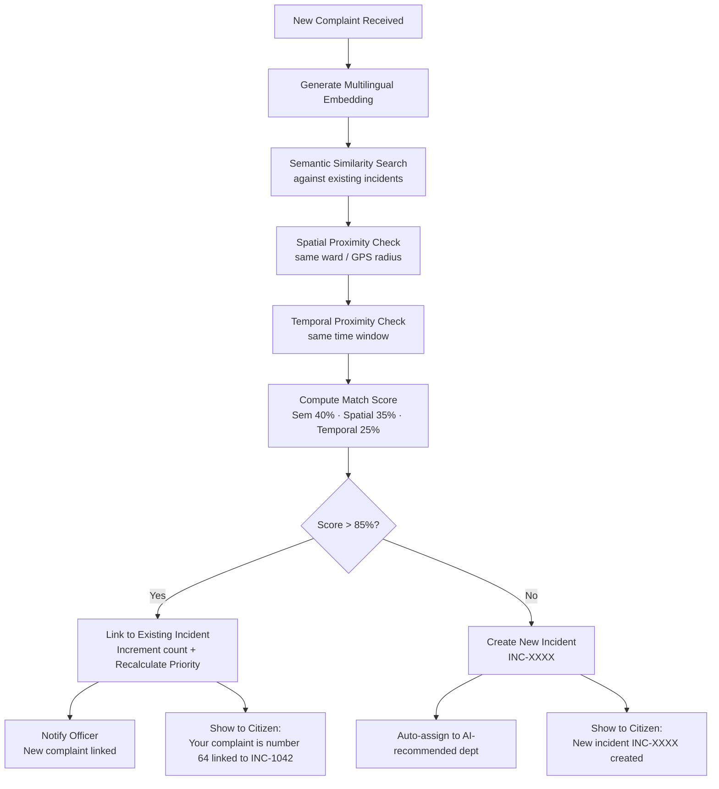

---

### Priority Calculation Flow

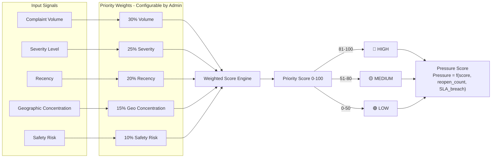

---

### Department Routing Flow

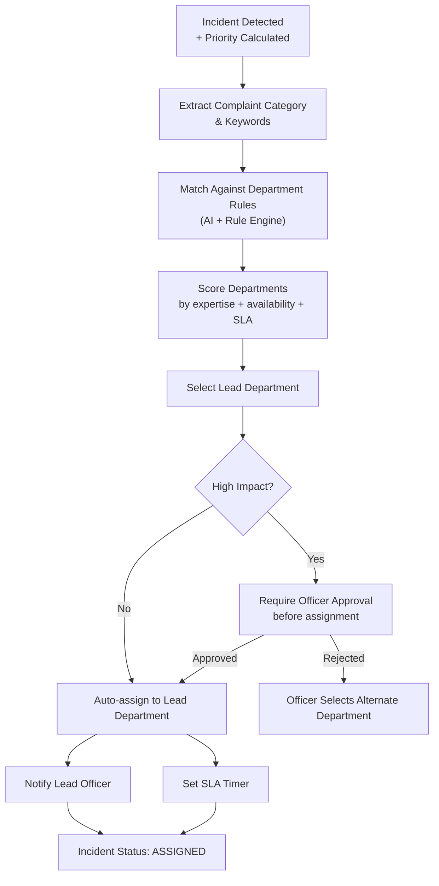

---

### Resolution & Verification Flow

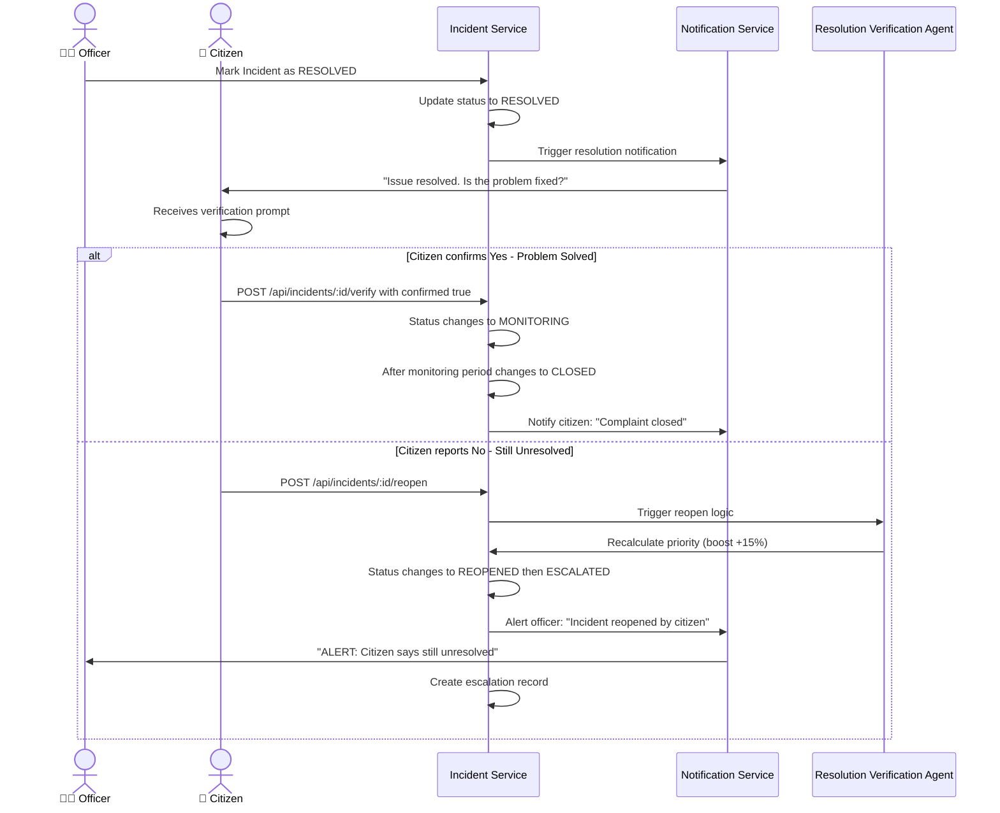

---

### Reopen & Escalation Flow

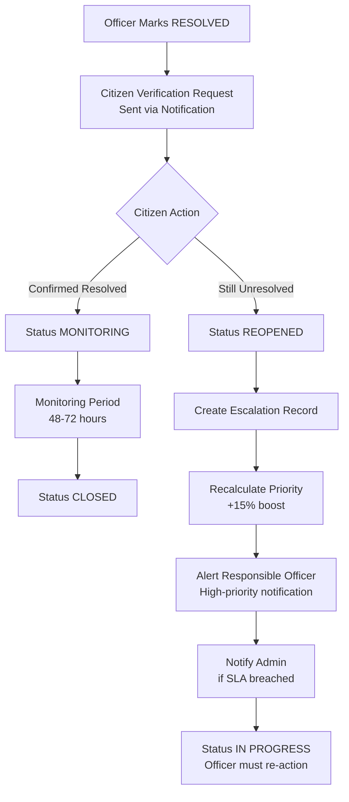

---

### Notification Flow

```mermaid
flowchart LR
    EVT["System Event\n(Status Change / AI Action)"]
    EVT --> COMM["Communication Agent"]
    COMM --> LANG["Detect Citizen's\nLanguage Preference"]
    LANG --> TMPL["Select Notification Template\nTamil / English / Tanglish"]
    TMPL --> GEN["Generate Personalised Message\nvia LLM / Template Engine"]
    GEN --> STORE["Store in Notifications DB"]
    STORE --> PUSH["Push to Citizen\n(WebSocket / Polling)"]
    PUSH --> BELL["Notification Bell\nin Citizen Dashboard"]

    subgraph TYPES["Notification Types"]
        N1["Complaint Submitted"]
        N2["Incident Detected / Linked"]
        N3["Department Assigned"]
        N4["In Progress"]
        N5["Resolved - Please Verify"]
        N6["Incident Reopened"]
        N7["Complaint Closed"]
    end
```

---

### Duplicate vs Civic Incident Detection

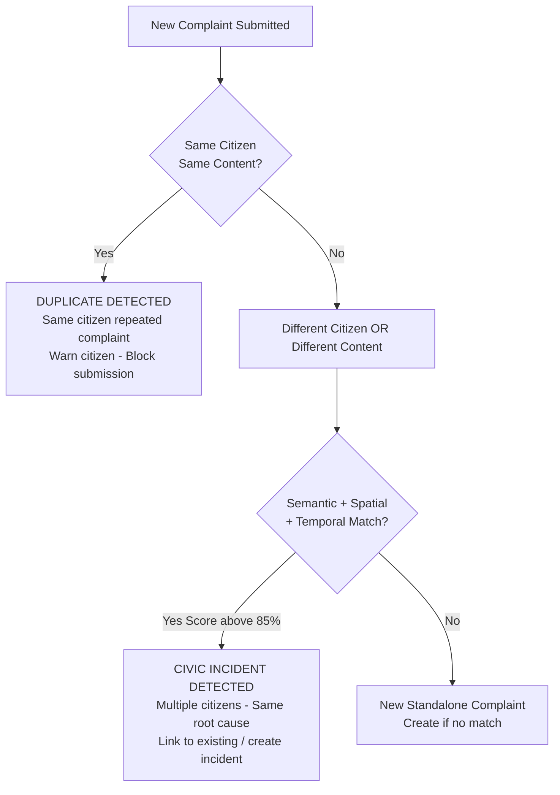

---

### Killer Demo Flow

```mermaid
flowchart TD
    DEMO["KILLER DEMO\nRUN KILLER DEMO Button Clicked"]

    DEMO --> S1["Step 1 — Citizen Submits\nEnga street la morning la irundhu water varala\nneraya houses affected"]

    S1 --> S2["Step 2 — Language Agent\nDetects: Tanglish\nCategory: Water Supply\nSeverity: High - Time: Since Morning"]

    S2 --> S3["Step 3 — AI Asks for Location\nI understand this is a water supply\nproblem. Please share your location.\nCitizen selects: Ward 17"]

    S3 --> S4["Step 4 — Image Upload\nCitizen uploads street photo"]

    S4 --> S5["Step 5 — Evidence Agent\nDetects: Standing Water\nRoad Surface Damage\nDrainage Overflow - 87% confidence"]

    S5 --> S6["Step 6 — Incident Intelligence\n63 related complaints found\nINC-1042 exists"]

    S6 --> S7["Step 7 — Complaint Linked\nYour complaint is number 64 linked to INC-1042\nAffected citizens: 63 to 64"]

    S7 --> S8["Step 8 — Priority Recalculated\n82 to 87 out of 100\nHIGH Priority - Pressure: 82/100"]

    S8 --> S9["Step 9 — Department Recommended\nLead: Water Board\nSupport: Municipal Engineering"]

    S9 --> S10["Step 10 — Officer Receives Incident\nOfficer Dashboard updates\nNew linked complaint alert"]

    S10 --> S11["Step 11 — Officer Action\nAssigned to In Progress"]

    S11 --> S12["Step 12 — Citizen Dashboard Updates\nIn Progress\nWork has started on your complaint"]

    S12 --> S13["Step 13 — Officer Marks Resolved"]

    S13 --> S14["Step 14 — Citizen Verification\nIs the problem actually resolved?"]

    S14 --> S15["Step 15 — Citizen: Still Unresolved"]

    S15 --> S16["Step 16 — System Auto-Reopens\nIncident Reopened\nPriority Recalculated +15%\nOfficer Alerted\nEscalation Created"]
```

---

## 📊 Complaint Status Lifecycle

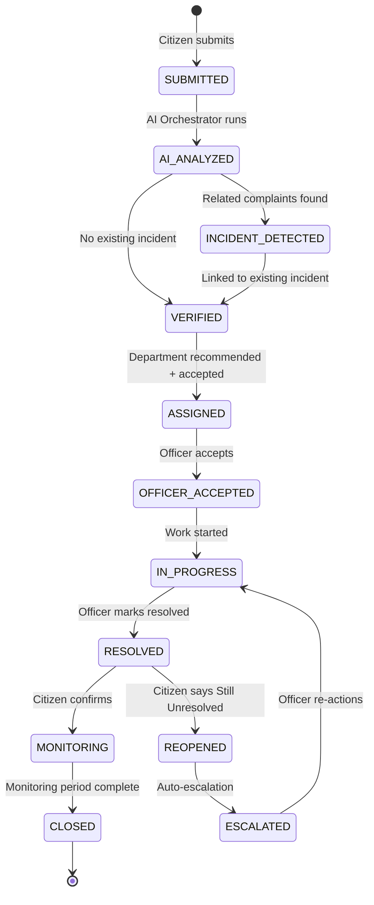

---

## 🗄️ Data Models

### Citizen

```typescript
interface ICitizen {
  _id: ObjectId;
  name: string;
  email: string;                    // Unique, indexed
  passwordHash: string;
  phone?: string;
  languagePreference: 'tamil' | 'english' | 'tanglish';
  location?: {
    ward: string;
    address: string;
    coordinates: [number, number];  // [lng, lat]
  };
  isVerified: boolean;
  isActive: boolean;
  createdAt: Date;
  updatedAt: Date;
}
```

### Officer

```typescript
interface IOfficer {
  _id: ObjectId;
  name: string;
  email: string;                    // Unique, indexed
  passwordHash: string;
  employeeId: string;
  department: ObjectId;             // ref: Department
  designation: string;
  role: 'officer' | 'supervisor';
  status: 'active' | 'inactive' | 'on_leave';
  assignedIncidents: ObjectId[];    // ref: Incident[]
  createdAt: Date;
  updatedAt: Date;
}
```

### Complaint

```typescript
interface IComplaint {
  _id: ObjectId;
  complaintId: string;              // CMP-XXXXX (human-readable)
  citizenId: ObjectId;             // ref: Citizen
  rawText: string;
  language: 'tamil' | 'english' | 'tanglish';
  category: string;                 // Water Supply, Road Damage, etc.
  issue: string;
  severity: 'low' | 'medium' | 'high' | 'critical';
  affectedPopulation: string;
  timeReference: string;            // "since morning", "3 days"
  location: {
    ward: string;
    address?: string;
    coordinates?: [number, number];
  };
  media: {
    images: string[];               // file paths / URLs
    voice?: string;
    evidenceAnalysis?: object;
  };
  incidentId?: ObjectId;           // ref: Incident
  aiConfidence: number;            // 0-100
  isDuplicate: boolean;
  status: ComplaintStatus;
  timeline: TimelineEntry[];
  createdAt: Date;
  updatedAt: Date;
}
```

### Incident

```typescript
interface IIncident {
  _id: ObjectId;
  incidentId: string;               // INC-XXXX (human-readable)
  title: string;
  category: string;
  description: string;
  location: {
    ward: string;
    address?: string;
    coordinates?: [number, number];
    radius?: number;                // affected radius in metres
  };
  complaintIds: ObjectId[];        // ref: Complaint[]
  affectedCitizenCount: number;
  priorityScore: number;           // 0-100
  pressureScore: number;           // 0-100
  confidenceScore: number;         // AI confidence 0-100
  semanticSimilarity?: number;
  spatialProximity?: number;
  temporalProximity?: number;
  department: ObjectId;            // ref: Department (lead)
  supportingDepartments: ObjectId[];
  assignedOfficer?: ObjectId;      // ref: Officer
  status: IncidentStatus;
  aiReasoning: string;
  timeline: TimelineEntry[];
  evidence: string[];              // officer-uploaded field evidence
  reopenedAt?: Date;
  resolvedAt?: Date;
  closedAt?: Date;
  escalationCount: number;
  slaDeadline?: Date;
  createdAt: Date;
  updatedAt: Date;
}
```

### Department

```typescript
interface IDepartment {
  _id: ObjectId;
  name: string;
  code: string;                     // e.g. WATER, ROADS
  description: string;
  headOfficer?: ObjectId;
  officers: ObjectId[];
  categories: string[];             // complaint categories handled
  slaDays: number;                  // SLA in business days
  contactEmail: string;
  contactPhone: string;
  isActive: boolean;
  createdAt: Date;
}
```

### Notification

```typescript
interface INotification {
  _id: ObjectId;
  citizenId: ObjectId;             // ref: Citizen
  complaintId?: ObjectId;
  incidentId?: ObjectId;
  type: NotificationType;
  title: string;
  message: string;                  // In citizen's language
  language: 'tamil' | 'english' | 'tanglish';
  isRead: boolean;
  createdAt: Date;
}
```

### AuditLog

```typescript
interface IAuditLog {
  _id: ObjectId;
  userId: ObjectId;
  userRole: 'citizen' | 'officer' | 'admin' | 'ai';
  action: string;                   // CREATE_COMPLAINT, UPDATE_STATUS, etc.
  entityType: string;               // Complaint, Incident, User
  entityId: ObjectId;
  previousValue?: object;
  newValue?: object;
  ipAddress?: string;
  userAgent?: string;
  description: string;
  timestamp: Date;
}
```

---

## 🔌 API Reference

### Authentication

| Method | Endpoint | Description | Auth |
|---|---|---|---|
| `POST` | `/api/auth/register` | Citizen registration | Public |
| `POST` | `/api/auth/login` | Login (all roles) | Public |
| `POST` | `/api/auth/logout` | Logout + invalidate token | JWT |
| `POST` | `/api/auth/refresh` | Refresh access token | Refresh Token |
| `GET` | `/api/auth/me` | Get current user profile | JWT |

### Complaints

| Method | Endpoint | Description | Auth |
|---|---|---|---|
| `POST` | `/api/complaints` | Submit a complaint | Citizen |
| `GET` | `/api/complaints` | List complaints | Citizen/Officer/Admin |
| `GET` | `/api/complaints/:id` | Get complaint details | Citizen/Officer |
| `GET` | `/api/complaints/:id/timeline` | Get full timeline | Citizen/Officer |
| `POST` | `/api/complaints/:id/verify` | Citizen resolution verification | Citizen |

### Incidents

| Method | Endpoint | Description | Auth |
|---|---|---|---|
| `GET` | `/api/incidents` | List all incidents | Officer/Admin |
| `GET` | `/api/incidents/:id` | Get incident details | Officer/Admin |
| `POST` | `/api/incidents/:id/accept` | Officer accepts incident | Officer |
| `POST` | `/api/incidents/:id/assign` | Assign / reassign department | Officer/Admin |
| `POST` | `/api/incidents/:id/status` | Update incident status | Officer |
| `POST` | `/api/incidents/:id/progress` | Add progress update | Officer |
| `POST` | `/api/incidents/:id/evidence` | Upload field evidence | Officer |
| `POST` | `/api/incidents/:id/resolve` | Mark as resolved | Officer |
| `POST` | `/api/incidents/:id/reopen` | Reopen incident | Citizen/Admin |
| `POST` | `/api/incidents/:id/escalate` | Escalate incident | Officer/Admin |

### AI Endpoints

| Method | Endpoint | Description | Auth |
|---|---|---|---|
| `POST` | `/api/ai/analyze` | Full complaint analysis | Internal |
| `POST` | `/api/ai/detect-duplicate` | Duplicate detection | Internal |
| `POST` | `/api/ai/detect-incident` | Incident clustering | Internal |
| `POST` | `/api/ai/calculate-priority` | Priority scoring | Internal |
| `POST` | `/api/ai/recommend-department` | Department routing | Internal |
| `POST` | `/api/ai/analyze-image` | Image evidence analysis | Internal |

### Dashboard & Analytics

| Method | Endpoint | Description | Auth |
|---|---|---|---|
| `GET` | `/api/dashboard/citizen` | Citizen dashboard stats | Citizen |
| `GET` | `/api/dashboard/officer` | Officer dashboard stats | Officer |
| `GET` | `/api/dashboard/admin` | Admin dashboard stats | Admin |
| `GET` | `/api/analytics/complaints` | Complaint analytics | Admin |
| `GET` | `/api/analytics/incidents` | Incident analytics | Admin |
| `GET` | `/api/analytics/departments` | Department performance | Admin |
| `GET` | `/api/analytics/resolution` | Resolution rate analytics | Admin |

### Notifications & Audit

| Method | Endpoint | Description | Auth |
|---|---|---|---|
| `GET` | `/api/notifications` | Get user notifications | JWT |
| `PATCH` | `/api/notifications/:id/read` | Mark notification as read | JWT |
| `PATCH` | `/api/notifications/read-all` | Mark all as read | JWT |
| `GET` | `/api/audit-logs` | Get audit logs | Admin |

### Admin

| Method | Endpoint | Description | Auth |
|---|---|---|---|
| `GET` / `POST` | `/api/admin/users` | Manage citizens | Admin |
| `GET` / `POST` | `/api/admin/officers` | Manage officers | Admin |
| `GET` / `POST` | `/api/admin/departments` | Manage departments | Admin |
| `GET` / `PATCH` | `/api/admin/ai-settings` | Configure AI weights | Admin |
| `GET` | `/api/admin/audit-logs` | Full audit logs | Admin |

---

## 📁 Folder Structure

The project follows a **feature-based MVC + Modular** architecture, aligned with [Bulletproof React](https://github.com/alan2207/bulletproof-react) standards for the frontend and a clean layered MVC structure for the backend.

```
hackfushion/
│
├── README.md
├── .env.example
├── .gitignore
├── docker-compose.yml
├── docker-compose.prod.yml
│
├── client/                          # React + TypeScript Frontend
│   ├── package.json
│   ├── tsconfig.json
│   ├── vite.config.ts
│   ├── tailwind.config.ts
│   ├── index.html
│   │
│   └── src/
│       ├── main.tsx                 # App entry point
│       ├── App.tsx                  # Root component + Router
│       │
│       ├── assets/                  # Static assets
│       │   ├── images/
│       │   ├── icons/
│       │   └── fonts/
│       │
│       ├── config/                  # App-wide configuration
│       │   ├── env.ts               # Typed environment variables
│       │   ├── constants.ts         # App constants
│       │   └── routes.ts            # Route path constants
│       │
│       ├── types/                   # Global TypeScript types
│       │   ├── complaint.types.ts
│       │   ├── incident.types.ts
│       │   ├── user.types.ts
│       │   ├── notification.types.ts
│       │   ├── api.types.ts
│       │   └── index.ts
│       │
│       ├── lib/                     # Third-party library configs
│       │   ├── axios.ts             # Axios instance + interceptors
│       │   ├── react-query.ts       # TanStack Query config
│       │   └── leaflet.ts           # Leaflet map setup
│       │
│       ├── store/                   # Zustand global state
│       │   ├── auth.store.ts        # Auth state (user, token)
│       │   ├── notification.store.ts
│       │   ├── demo.store.ts        # Killer demo state machine
│       │   └── index.ts
│       │
│       ├── hooks/                   # Shared custom hooks
│       │   ├── useAuth.ts
│       │   ├── useNotifications.ts
│       │   ├── usePolling.ts        # Real-time simulation
│       │   └── useMediaUpload.ts
│       │
│       ├── utils/                   # Shared utilities
│       │   ├── format.ts            # Date, number formatters
│       │   ├── validators.ts        # Zod schemas
│       │   ├── cn.ts                # Class name utility
│       │   └── mock-ai.ts           # Mock AI responses
│       │
│       ├── components/              # Shared UI components
│       │   ├── ui/                  # Primitive components
│       │   │   ├── Button.tsx
│       │   │   ├── Badge.tsx
│       │   │   ├── Card.tsx
│       │   │   ├── Modal.tsx
│       │   │   ├── Spinner.tsx
│       │   │   ├── Timeline.tsx
│       │   │   ├── StatusBadge.tsx
│       │   │   └── PriorityBadge.tsx
│       │   │
│       │   ├── layout/              # Layout components
│       │   │   ├── RootLayout.tsx
│       │   │   ├── CitizenLayout.tsx
│       │   │   ├── OfficerLayout.tsx
│       │   │   ├── AdminLayout.tsx
│       │   │   ├── Navbar.tsx
│       │   │   └── Sidebar.tsx
│       │   │
│       │   ├── charts/              # Recharts components
│       │   │   ├── ComplaintsByCategory.tsx
│       │   │   ├── PriorityDistribution.tsx
│       │   │   ├── ResolutionRate.tsx
│       │   │   └── DepartmentPerformance.tsx
│       │   │
│       │   ├── map/                 # Leaflet map components
│       │   │   ├── CivicMap.tsx
│       │   │   ├── IncidentCluster.tsx
│       │   │   └── HeatmapLayer.tsx
│       │   │
│       │   └── notifications/
│       │       ├── NotificationBell.tsx
│       │       └── NotificationList.tsx
│       │
│       └── features/                # Feature modules (MVC pattern)
│           │
│           ├── auth/
│           │   ├── components/
│           │   │   ├── LoginForm.tsx
│           │   │   └── RegisterForm.tsx
│           │   ├── hooks/
│           │   │   └── useLogin.ts
│           │   ├── api/
│           │   │   └── auth.api.ts
│           │   ├── pages/
│           │   │   ├── LoginPage.tsx
│           │   │   └── RegisterPage.tsx
│           │   └── index.ts
│           │
│           ├── landing/
│           │   ├── components/
│           │   │   ├── HeroSection.tsx
│           │   │   ├── WorkflowSection.tsx
│           │   │   ├── FeatureCards.tsx
│           │   │   └── ComparisonSection.tsx
│           │   └── pages/
│           │       └── LandingPage.tsx
│           │
│           ├── citizen/
│           │   ├── components/
│           │   │   ├── ComplaintCard.tsx
│           │   │   ├── ComplaintTimeline.tsx
│           │   │   ├── ResolutionVerification.tsx
│           │   │   └── StatsOverview.tsx
│           │   ├── hooks/
│           │   │   ├── useMyComplaints.ts
│           │   │   └── useTrackComplaint.ts
│           │   ├── api/
│           │   │   └── citizen.api.ts
│           │   └── pages/
│           │       ├── CitizenDashboard.tsx
│           │       ├── TrackComplaintPage.tsx
│           │       └── ProfilePage.tsx
│           │
│           ├── complaint/
│           │   ├── components/
│           │   │   ├── ComplaintForm.tsx     # CivicAssist AI chatbot
│           │   │   ├── VoiceInput.tsx
│           │   │   ├── ImageUpload.tsx
│           │   │   ├── LocationPicker.tsx
│           │   │   ├── AIAnalysisDisplay.tsx
│           │   │   ├── AIProcessingAnimation.tsx
│           │   │   ├── IncidentLinkCard.tsx
│           │   │   └── DuplicateWarning.tsx
│           │   ├── hooks/
│           │   │   ├── useSubmitComplaint.ts
│           │   │   └── useAIAnalysis.ts
│           │   ├── api/
│           │   │   └── complaint.api.ts
│           │   └── pages/
│           │       └── ReportComplaintPage.tsx
│           │
│           ├── officer/
│           │   ├── components/
│           │   │   ├── IncidentTable.tsx
│           │   │   ├── IncidentDetailPanel.tsx
│           │   │   ├── AIReasoningCard.tsx
│           │   │   ├── ActionButtons.tsx
│           │   │   ├── ProgressUpdateForm.tsx
│           │   │   ├── EvidenceUpload.tsx
│           │   │   └── OfficerStatsCards.tsx
│           │   ├── hooks/
│           │   │   ├── useOfficerIncidents.ts
│           │   │   └── useUpdateIncident.ts
│           │   ├── api/
│           │   │   └── officer.api.ts
│           │   └── pages/
│           │       ├── OfficerDashboard.tsx
│           │       ├── IncidentDetailPage.tsx
│           │       └── AIOperationsPage.tsx
│           │
│           └── admin/
│               ├── components/
│               │   ├── AdminStatsCards.tsx
│               │   ├── UserManagementTable.tsx
│               │   ├── DepartmentManager.tsx
│               │   ├── PriorityWeightsConfig.tsx
│               │   └── AuditLogTable.tsx
│               ├── hooks/
│               │   └── useAdminDashboard.ts
│               ├── api/
│               │   └── admin.api.ts
│               └── pages/
│                   ├── AdminDashboard.tsx
│                   ├── UsersPage.tsx
│                   ├── OfficersPage.tsx
│                   ├── DepartmentsPage.tsx
│                   ├── AnalyticsPage.tsx
│                   ├── AISettingsPage.tsx
│                   └── AuditLogsPage.tsx
│
│
└── server/                          # Node.js + Express Backend
    ├── package.json
    ├── tsconfig.json
    │
    └── src/
        ├── app.ts                   # Express app setup
        ├── server.ts                # Entry point
        │
        ├── config/
        │   ├── env.ts               # Environment config
        │   ├── database.ts          # MongoDB connection
        │   └── redis.ts             # Redis connection (optional)
        │
        ├── models/                  # Mongoose Models - M in MVC
        │   ├── citizen.model.ts
        │   ├── officer.model.ts
        │   ├── admin.model.ts
        │   ├── complaint.model.ts
        │   ├── incident.model.ts
        │   ├── department.model.ts
        │   ├── notification.model.ts
        │   └── audit-log.model.ts
        │
        ├── controllers/             # Request handlers - C in MVC
        │   ├── auth.controller.ts
        │   ├── complaint.controller.ts
        │   ├── incident.controller.ts
        │   ├── notification.controller.ts
        │   ├── dashboard.controller.ts
        │   ├── analytics.controller.ts
        │   └── admin.controller.ts
        │
        ├── services/                # Business logic - Service Layer
        │   ├── complaint.service.ts
        │   ├── incident.service.ts
        │   ├── notification.service.ts
        │   ├── auth.service.ts
        │   ├── dashboard.service.ts
        │   └── audit.service.ts
        │
        ├── ai/                      # AI Orchestrator Module
        │   ├── orchestrator.ts      # Supervisor orchestrator
        │   ├── agents/
        │   │   ├── language.agent.ts
        │   │   ├── complaint.agent.ts
        │   │   ├── evidence.agent.ts
        │   │   ├── duplicate.agent.ts
        │   │   ├── incident.agent.ts
        │   │   ├── priority.agent.ts
        │   │   ├── routing.agent.ts
        │   │   ├── communication.agent.ts
        │   │   └── resolution.agent.ts
        │   ├── mock/
        │   │   └── mock-ai.service.ts  # Fallback when no API key
        │   └── utils/
        │       ├── embeddings.ts
        │       ├── clustering.ts
        │       └── scoring.ts
        │
        ├── routes/                  # Express Routers
        │   ├── index.ts
        │   ├── auth.routes.ts
        │   ├── complaint.routes.ts
        │   ├── incident.routes.ts
        │   ├── ai.routes.ts
        │   ├── dashboard.routes.ts
        │   ├── notification.routes.ts
        │   ├── analytics.routes.ts
        │   └── admin.routes.ts
        │
        ├── middleware/
        │   ├── auth.middleware.ts   # JWT verification
        │   ├── rbac.middleware.ts   # Role-based access control
        │   ├── rateLimiter.ts       # Rate limiting
        │   ├── validate.ts          # Request validation (Zod)
        │   ├── audit.ts             # Audit log middleware
        │   ├── errorHandler.ts      # Global error handler
        │   └── upload.ts            # Multer file uploads
        │
        ├── validators/              # Zod schemas
        │   ├── complaint.validator.ts
        │   ├── incident.validator.ts
        │   └── auth.validator.ts
        │
        ├── types/
        │   ├── complaint.types.ts
        │   ├── incident.types.ts
        │   └── express.d.ts         # Express request augmentation
        │
        ├── utils/
        │   ├── jwt.ts
        │   ├── bcrypt.ts
        │   ├── idGenerator.ts       # CMP-XXXXX / INC-XXXX generators
        │   └── logger.ts
        │
        └── seed/                    # Demo data seeding
            ├── index.ts
            ├── citizens.seed.ts
            ├── officers.seed.ts
            ├── departments.seed.ts
            ├── complaints.seed.ts
            └── incidents.seed.ts
```

---

## 🛠️ Technology Stack

### Frontend

| Technology | Version | Purpose |
|---|---|---|
| [React](https://react.dev/) | 18+ | UI library |
| [TypeScript](https://www.typescriptlang.org/) | 5.0+ | Type safety |
| [Vite](https://vitejs.dev/) | 5+ | Build tool |
| [Tailwind CSS](https://tailwindcss.com/) | 3.4+ | Utility-first styling |
| [React Router v6](https://reactrouter.com/) | 6+ | Routing |
| [TanStack Query](https://tanstack.com/query) | 5+ | Data fetching + cache |
| [Zustand](https://zustand.docs.pmnd.rs/) | 4+ | Global state management |
| [React Hook Form](https://react-hook-form.com/) | 7+ | Form handling |
| [Zod](https://zod.dev/) | 3+ | Schema validation |
| [Recharts](https://recharts.org/) | 2+ | Data visualisation |
| [Leaflet.js](https://leafletjs.com/) | 1.9+ | Interactive maps |
| [Framer Motion](https://www.framer.com/motion/) | 11+ | Animations |
| [Lucide React](https://lucide.dev/) | Latest | Icons |

### Backend

| Technology | Version | Purpose |
|---|---|---|
| [Node.js](https://nodejs.org/) | 18+ | Runtime |
| [TypeScript](https://www.typescriptlang.org/) | 5.0+ | Type safety |
| [Express.js](https://expressjs.com/) | 4+ | HTTP framework |
| [MongoDB](https://mongodb.com/) | 7+ | Primary database |
| [Mongoose](https://mongoosejs.com/) | 8+ | ODM |
| [Redis](https://redis.io/) | 7+ | Caching (optional) |
| [Multer](https://github.com/expressjs/multer) | 1+ | File uploads |
| [bcrypt](https://www.npmjs.com/package/bcrypt) | Latest | Password hashing |
| [jsonwebtoken](https://www.npmjs.com/package/jsonwebtoken) | Latest | JWT auth |
| [Zod](https://zod.dev/) | 3+ | Request validation |
| [Winston](https://github.com/winstonjs/winston) | Latest | Logging |
| [express-rate-limit](https://www.npmjs.com/package/express-rate-limit) | Latest | Rate limiting |
| [helmet](https://helmetjs.github.io/) | Latest | HTTP security headers |
| [cors](https://www.npmjs.com/package/cors) | Latest | CORS handling |

### AI & ML

| Technology | Purpose |
|---|---|
| OpenAI GPT-4o / Mock Service | Complaint understanding, multilingual NLP |
| Multilingual Embeddings (text-embedding-3) | Cross-language semantic similarity |
| OpenAI Whisper / Mock | Speech-to-text for Tamil and English |
| GPT-4o Vision / Mock | Image evidence analysis |
| DBSCAN Clustering | Spatial-temporal incident grouping |

### DevOps & Tooling

| Technology | Purpose |
|---|---|
| Docker + Docker Compose | Containerisation |
| GitHub Actions | CI/CD |
| Vitest | Unit and integration testing |
| React Testing Library | Component testing |
| ESLint + Prettier | Code quality |

---

## 🔒 Security Architecture

This platform handles sensitive civic data and citizen PII. A comprehensive security model is implemented across all layers.

### Request Security Pipeline

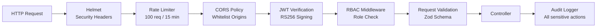

### Security Controls

| Security Control | Implementation |
|---|---|
| **Authentication** | JWT — Access Token 15 min + Refresh Token 7 days |
| **Signing Algorithm** | RS256 (asymmetric key pair) |
| **Password Hashing** | bcrypt with cost factor 12 |
| **Role-Based Access Control** | Middleware enforcing citizen / officer / admin boundaries |
| **Rate Limiting** | 100 requests / 15 minutes per IP; 10 auth attempts / hour |
| **HTTP Headers** | Helmet.js — CSP, HSTS, X-Frame-Options, X-XSS-Protection |
| **CORS** | Whitelist-only origin policy |
| **Input Validation** | Zod schemas on every API endpoint |
| **File Upload Security** | MIME type whitelist, 10 MB size limit, path traversal prevention |
| **Audit Logging** | Every sensitive action logged with user, IP, timestamp |
| **Secrets Management** | Environment variables only — never hardcoded |

### Data Security

| Control | Detail |
|---|---|
| **PII Minimisation** | Only necessary citizen data stored |
| **Field Encryption** | Sensitive fields encrypted at rest (AES-256) |
| **MongoDB Security** | Auth enabled, TLS enforced, not publicly exposed |
| **Image Storage** | Private bucket, pre-signed URLs only |
| **NoSQL Injection Prevention** | Mongoose ODM + input sanitisation |
| **XSS Prevention** | Content Security Policy + DOMPurify on rendered content |
| **CSRF Protection** | SameSite cookie attribute + CSRF token for state-changing requests |

### JWT Authentication Flow

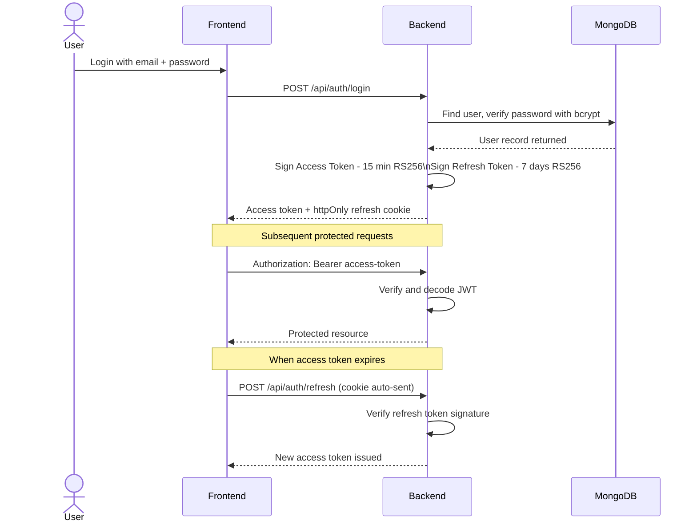

### RBAC Permission Matrix

| Resource | Citizen | Officer | Admin |
|---|---|---|---|
| Submit complaint | Own only | No | No |
| View own complaints | Own only | Assigned incidents | All |
| View incident details | Linked incidents | Assigned | All |
| Update incident status | No | Yes | Yes |
| Resolve incident | No | Yes | Yes |
| Verify resolution | Own complaints | No | Yes |
| Reopen incident | Own complaints | No | Yes |
| Manage officers | No | No | Yes |
| Configure AI weights | No | No | Yes |
| View audit logs | No | No | Yes |
| Export data | No | No | Yes |

---

## ⚙️ Environment Configuration

### Server — `server/.env`

```env
# Application
NODE_ENV=development
PORT=5000

# Database
MONGODB_URI=mongodb://localhost:27017/civicgrievance
REDIS_URL=redis://localhost:6379

# JWT — Generate with: openssl genrsa -out private.pem 2048
JWT_PRIVATE_KEY_PATH=./certs/private.pem
JWT_PUBLIC_KEY_PATH=./certs/public.pem
JWT_ACCESS_EXPIRES=15m
JWT_REFRESH_EXPIRES=7d

# AI Services — leave blank to use mock AI
OPENAI_API_KEY=
OPENAI_MODEL=gpt-4o

# File Storage
UPLOAD_DIR=./uploads
MAX_FILE_SIZE_MB=10

# Rate Limiting
RATE_LIMIT_WINDOW_MS=900000
RATE_LIMIT_MAX=100

# CORS
CORS_ORIGIN=http://localhost:3000

# Logging
LOG_LEVEL=info
```

### Client — `client/.env`

```env
VITE_API_BASE_URL=http://localhost:5000
VITE_MAPS_TILE_URL=https://{s}.tile.openstreetmap.org/{z}/{x}/{y}.png
VITE_ENABLE_MOCK_AI=true
VITE_APP_NAME=CivicAssist
```

---

## 🚀 Installation & Setup

### Prerequisites

- [Node.js](https://nodejs.org/) 18+
- [MongoDB](https://mongodb.com/) 7+ (local or Atlas)
- [Git](https://git-scm.com/)
- [Docker](https://docker.com/) (optional but recommended)

### Quick Start with Docker

```bash
# Clone the repository
git clone https://github.com/your-org/hackfushion.git
cd hackfushion

# Copy environment files
cp server/.env.example server/.env
cp client/.env.example client/.env

# Start all services
docker-compose up -d

# Seed demo data
docker-compose exec server npm run seed

# Open the app
# Frontend: http://localhost:3000
# API:      http://localhost:5000
```

### Manual Setup

```bash
# Clone
git clone https://github.com/your-org/hackfushion.git
cd hackfushion

# ---- Backend Setup ----
cd server
cp .env.example .env
# Edit .env with your MongoDB URI and config

npm install

# Generate JWT key pair
mkdir -p certs
openssl genrsa -out certs/private.pem 2048
openssl rsa -in certs/private.pem -pubout -out certs/public.pem

# Seed demo data
npm run seed

# Start dev server
npm run dev
# Backend: http://localhost:5000

# ---- Frontend Setup ----
cd ../client
cp .env.example .env

npm install
npm run dev
# Frontend: http://localhost:3000
```

---

## ▶️ Running the Application

```bash
# Run both client and server from root
npm run dev

# Or individually
cd server && npm run dev
cd client && npm run dev
```

### Available Scripts

#### Server Scripts

| Script | Description |
|---|---|
| `npm run dev` | Start with nodemon hot reload |
| `npm run build` | Compile TypeScript to JavaScript |
| `npm start` | Run compiled production build |
| `npm run seed` | Seed demo data into MongoDB |
| `npm run seed:reset` | Drop and re-seed all data |
| `npm test` | Run Vitest unit tests |
| `npm run lint` | ESLint check |

#### Client Scripts

| Script | Description |
|---|---|
| `npm run dev` | Start Vite development server |
| `npm run build` | Production bundle |
| `npm run preview` | Preview production build locally |
| `npm test` | Run Vitest + React Testing Library |
| `npm run lint` | ESLint check |
| `npm run type-check` | TypeScript type checking only |

---

## 🌱 Demo Data & Seeding

### Demo Login Credentials

| Role | Email | Password |
|---|---|---|
| Citizen | priya@demo.com | Demo@123 |
| Citizen | ravi@demo.com | Demo@123 |
| Officer (Water Board) | officer1@waterboard.gov | Officer@123 |
| Officer (Roads) | officer2@roads.gov | Officer@123 |
| Admin | admin@municipality.gov | Admin@123 |

### Seeded Data Volume

| Entity | Count |
|---|---|
| Citizens | 50 |
| Officers | 10 |
| Departments | 5 |
| Complaints | 100+ |
| Incidents | 20 |
| Notifications | 200+ |
| Audit Logs | 500+ |

### Departments

| Code | Name | Categories |
|---|---|---|
| `WATER` | Water Board | Water Supply, Drainage |
| `ROADS` | Roads & Infrastructure | Road Damage, Traffic |
| `SANIT` | Sanitation Department | Garbage, Public Health |
| `ELEC` | Electrical Department | Streetlight, Power |
| `MUNIC` | Municipal Engineering | Flooding, Public Infrastructure |

### Pre-Seeded Incidents

| ID | Category | Complaints | Priority | Status |
|---|---|---|---|---|
| INC-1042 | Water Supply | 63 | HIGH | In Progress |
| INC-1038 | Road Damage | 31 | MEDIUM | Assigned |
| INC-1032 | Garbage | 48 | HIGH | Detected |
| INC-1029 | Streetlight | 12 | LOW | Resolved |

---

## 🧪 Testing

### Running Tests

```bash
# All tests
npm test

# Watch mode
npm run test:watch

# Coverage report
npm run test:coverage
```

### Test Structure

```
tests/
├── unit/
│   ├── services/
│   │   ├── complaint.service.test.ts
│   │   ├── incident.service.test.ts
│   │   └── notification.service.test.ts
│   ├── ai/
│   │   ├── language.agent.test.ts
│   │   ├── incident.agent.test.ts
│   │   └── priority.agent.test.ts
│   └── utils/
│       └── scoring.test.ts
│
├── integration/
│   ├── complaint.api.test.ts
│   ├── incident.api.test.ts
│   └── auth.api.test.ts
│
└── e2e/
    ├── citizen-flow.test.ts       # Submit → Track → Verify
    └── officer-flow.test.ts       # Accept → Progress → Resolve
```

### Key Test Scenarios

- Citizen submits complaint and receives complaint ID
- AI correctly detects Tanglish language
- Duplicate detection blocks re-submission from same citizen
- Incident clustering links semantically similar complaints
- Priority score increases when new complaint is linked
- Officer status update propagates to citizen timeline
- Citizen rejection of resolution reopens the incident
- RBAC blocks citizen from accessing officer-only endpoints
- Rate limiter blocks requests after threshold is exceeded

---

## 🚢 Deployment

### Docker Compose Production

```bash
docker-compose -f docker-compose.prod.yml up -d
```

### Recommended Cloud Services

| Component | Service |
|---|---|
| Frontend | Vercel / Netlify |
| Backend API | Railway / Render / AWS EC2 |
| Database | MongoDB Atlas |
| File Storage | AWS S3 / Cloudflare R2 |
| Cache | Upstash Redis |

---

## ⚡ CI/CD Pipeline

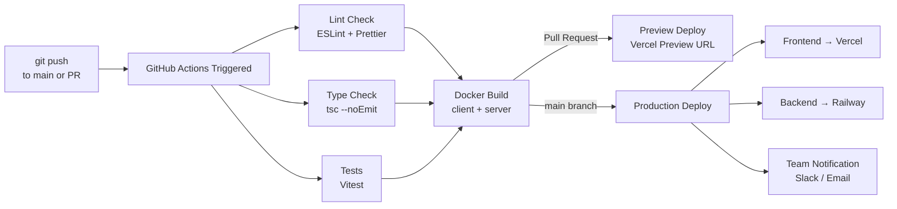

### GitHub Actions Workflow

```yaml
name: CI/CD Pipeline

on:
  push:
    branches: [main, develop]
  pull_request:
    branches: [main]

jobs:
  lint-and-test:
    runs-on: ubuntu-latest
    steps:
      - uses: actions/checkout@v4
      - uses: actions/setup-node@v4
        with:
          node-version: '18'
          cache: 'npm'

      - name: Install server dependencies
        run: cd server && npm ci

      - name: Install client dependencies
        run: cd client && npm ci

      - name: Lint server
        run: cd server && npm run lint

      - name: Lint client
        run: cd client && npm run lint

      - name: TypeScript type check
        run: cd client && npm run type-check

      - name: Run server tests
        run: cd server && npm test

      - name: Run client tests
        run: cd client && npm test

  build:
    needs: lint-and-test
    runs-on: ubuntu-latest
    steps:
      - uses: actions/checkout@v4
      - name: Build Docker images
        run: docker-compose -f docker-compose.prod.yml build
```

---

## 📈 Analytics & Monitoring

### Key Platform Metrics

| Metric | Description |
|---|---|
| **Complaint-to-Incident Ratio** | How many complaints collapse into one incident |
| **AI Confidence Score** | Average AI analysis confidence across complaints |
| **Resolution Rate** | Percentage of complaints resolved within SLA |
| **Reopen Rate** | Percentage of resolutions rejected by citizens |
| **Department Response Time** | Average time from assignment to first action |
| **Citizen Satisfaction** | Percentage of resolutions confirmed by citizens |

### Admin Analytics Views

- Complaints by category — pie / bar chart
- Incidents by ward — geographic heatmap
- Priority distribution — donut chart
- Resolution rate over time — line chart
- Reopened complaints trend — bar chart
- Department performance comparison — bar chart
- Average response time by department — table + bar
- Complaint-to-incident reduction funnel

```
Complaint-to-Incident Reduction Example:
100 Individual Complaints → 12 Civic Incidents
88% reduction in officer workload
```

---

## 🌐 Accessibility & Internationalisation

### Accessibility — WCAG 2.1 AA Compliance

- ARIA labels on all interactive elements
- Full keyboard navigation support
- Screen reader announcements for status changes
- Minimum 4.5:1 colour contrast ratio
- Visible focus indicators on all focusable elements
- Error messages associated with form fields via `aria-describedby`
- Semantic HTML structure throughout

### Language Support

| Language | Input | AI Understanding | Notifications |
|---|---|---|---|
| English | Text + Voice | Full | Yes |
| Tamil | Text + Voice | Full | Yes |
| Tanglish | Text | Full | Yes |

---

## 🤝 Contributing

### Development Workflow

```bash
# Create a feature branch
git checkout -b feature/your-feature-name

# Make changes following the folder structure and MVC pattern

# Lint and test before committing
npm run lint && npm test

# Commit using conventional commits
git commit -m "feat(complaint): add voice input support"

# Push and open a Pull Request
git push origin feature/your-feature-name
```

### Commit Convention

| Prefix | Use for |
|---|---|
| `feat:` | New feature |
| `fix:` | Bug fix |
| `docs:` | Documentation update |
| `style:` | Formatting changes — no logic |
| `refactor:` | Code restructuring |
| `test:` | Adding or updating tests |
| `chore:` | Build, config, dependency updates |

---

## 🎤 Hackathon Presentation Guide

### Demo Login Credentials

| Role | Email | Password |
|---|---|---|
| Citizen | priya@demo.com | Demo@123 |
| Officer | officer1@waterboard.gov | Officer@123 |
| Admin | admin@municipality.gov | Admin@123 |

### Recommended Demo Flow — 2 to 3 Minutes

1. **Landing Page** — Show the hero section, visual workflow, and feature cards (30 seconds)
2. **Click "Run Killer Demo"** — Automated walkthrough starts (90 seconds)
   - Complaint typed in Tanglish
   - AI analysis animation shows all 9 processing steps
   - Incident linking to INC-1042 — complaint becomes number 64
   - Priority updates from 82 to 87
   - Officer dashboard auto-updates in real time
   - Officer marks the incident resolved
   - Citizen receives verification prompt
   - Citizen selects "Still Unresolved"
   - System automatically reopens, escalates, and alerts officer
3. **Admin Dashboard** — Show analytics and complaint-to-incident reduction (30 seconds)
4. **Final Comparison Slide** — Traditional system vs our platform (15 seconds)

### Anticipated Judge Questions

| Question | Answer |
|---|---|
| What is your core innovation? | Incident intelligence — multiple complaints become one coordinated civic response |
| How is AI actually used? | Nine specialised agents in an orchestrator, each with a focused responsibility |
| Does it work without API keys? | Yes — complete mock AI fallback, fully demo-ready offline |
| How do you ensure resolution? | Citizen verification plus auto-reopen — the closed loop is our unique value |
| What about scalability? | Stateless API, MongoDB sharding ready, Redis caching, Docker containerised |

---

## 📄 License

This project is licensed under the **MIT License**.

```
MIT License

Copyright (c) 2026 HackFushion Team

Permission is hereby granted, free of charge, to any person obtaining a copy
of this software and associated documentation files (the "Software"), to deal
in the Software without restriction, including without limitation the rights
to use, copy, modify, merge, publish, distribute, sublicense, and/or sell
copies of the Software, and to permit persons to whom the Software is
furnished to do so, subject to the following conditions:

The above copyright notice and this permission notice shall be included in all
copies or substantial portions of the Software.

THE SOFTWARE IS PROVIDED "AS IS", WITHOUT WARRANTY OF ANY KIND, EXPRESS OR
IMPLIED, INCLUDING BUT NOT LIMITED TO THE WARRANTIES OF MERCHANTABILITY,
FITNESS FOR A PARTICULAR PURPOSE AND NONINFRINGEMENT. IN NO EVENT SHALL THE
AUTHORS OR COPYRIGHT HOLDERS BE LIABLE FOR ANY CLAIM, DAMAGES OR OTHER
LIABILITY, WHETHER IN AN ACTION OF CONTRACT, TORT OR OTHERWISE, ARISING FROM,
OUT OF OR IN CONNECTION WITH THE SOFTWARE OR THE USE OR OTHER DEALINGS IN THE
SOFTWARE.
```

---

<div align="center">

**Built with care for HackFushion**

*"Citizens simply speak or type their problem — our AI understands it, detects the civic incident behind it, coordinates the response, keeps citizens informed, and verifies that the problem is actually resolved."*

</div>
